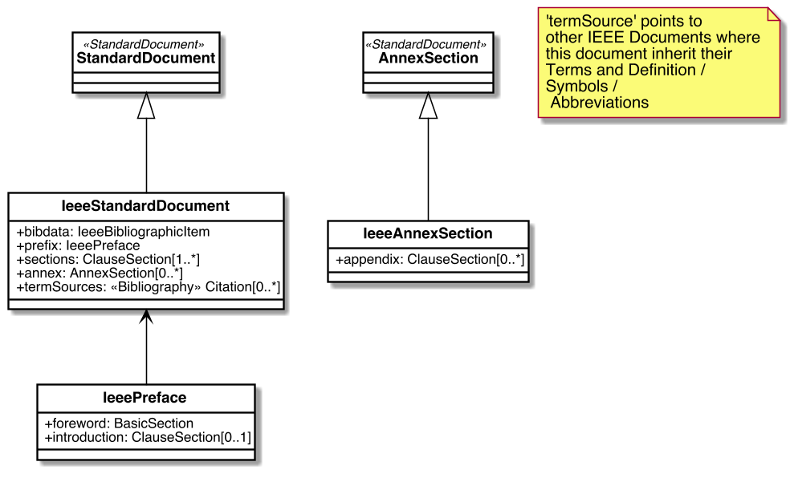
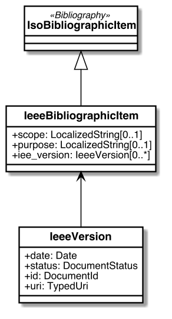

= Metanorma IEEE Models

image:https://github.com/metanorma/metanorma-model-ieee/workflows/make/badge.svg["Build Status", link="https://github.com/metanorma/metanorma-model-ieee/actions/workflows/make.yml"]

This is where we keep the Metanorma IEEE model definitions.

The IEEE Standard Document format is an instance of the
https://github.com/metanorma/metanorma-model-standoc[Metanorma StandardDocument model].
Details of the general model can be found on its page.

== IEEE Standard Document Model

== IEEE Bibliographic Item Model

